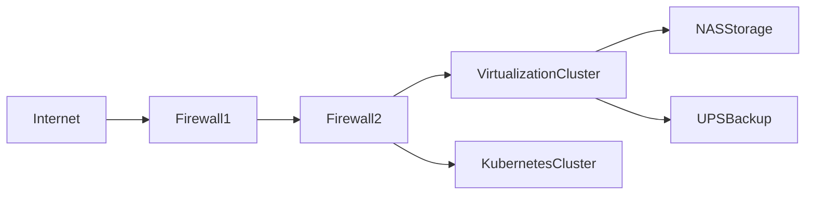

# Stephen Jacobs

## 💻 Senior Software Engineer

I'm a Senior Software Engineer at [Centerfield](https://www.centerfield.com), specializing in .NET 9, AWS, and event-driven architectures. My focus is on building scalable, resilient backend systems and continuously optimizing development workflows. I thrive on tackling challenging problems and finding innovative solutions in modern cloud environments.

---

## 🚀 About Me

- **Collaborative Team Member:** I enjoy working closely with my teammates, fostering an environment built on shared learning and collective problem-solving.
- **Lifelong Learner:** I'm always curious, regularly exploring new technologies and industry best practices.
- **Mentor & Advocate:** I actively mentor colleagues, sharing real-world insights and encouraging professional growth.
- **Quality-Driven:** I'm passionate about code quality, maintainability, and efficient software design, emphasizing best practices and test-driven development.
- **Balanced Approach:** I aim for meaningful growth both professionally and personally, ensuring a healthy balance between career achievements and personal fulfillment.

---

## 🎯 Certification Roadmap

I believe certifications are more than just credentials—they're structured opportunities for deepening my expertise.

| **Timeline** | **Certification**                           | **Status**         |
|-------------|--------------------------------------------|--------------------|
| **Q2 2025**  | GitHub Foundations                        | ⏳ In Progress      |
| **Q2 2025**  | Terraform Associate                       | ⏳ In Progress      |
| **Q3 2025**  | AWS Developer Associate                   | ❌ Not Started      |
| **Q3 2025**  | AWS DevOps Associate                      | ❌ Not Started      |
| **Q4 2025**  | AWS Solutions Architect Professional      | ❌ Not Started      |
| **Q4 2025**  | Security+                                 | ❌ Not Started      |
| **Q1 2026**  | Cloud+                                    | ❌ Not Started      |
| **Q2 2026**  | CNKA (Cloud Native Kubernetes Associate) | ❌ Not Started      |
| **Q3 2026**  | GCP Foundational                          | ❌ Not Started      |

---

## 🌱 Hobbies & Interests

Outside of work, I pursue activities that inspire and refresh me:

- **Outdoor Adventures:** Hiking, camping, and fishing help me unwind and reconnect with nature.
- **Sustainable Gardening:** I cultivate unique cacti and practice regenerative farming techniques, emphasizing biodiversity and healthy ecosystems.
- **Homelab Experimentation:** I maintain a robust homelab setup to explore and test cutting-edge technologies, continuously improving my skills and knowledge.

---

## 🏟️ Homelab Overview

My homelab serves as my personal platform for learning and experimentation, covering virtualization, container orchestration, and automation:

### 🔹 Key Components:
- **Virtualization Cluster (Intel NUCs):** Supports VMs and network simulations, enabling high-availability experiments.
- **Kubernetes Cluster (Raspberry Pi):** Runs containerized applications and custom microservices.
- **Advanced Security:** Multiple firewalls, layered network segmentation, and comprehensive traffic filtering.
- **Synology NAS Storage:** Reliable backups and high-capacity data storage.
- **Power Backup Systems:** Ensuring stability and protection during outages.
- **Core Services:** Pi-hole, AdGuard Home, Jellyfin, Homebridge, and various automation tools for streamlined management.

This setup lets me gain hands-on experience with DevOps practices, cloud automation, infrastructure-as-code, and distributed systems.

---

## 🏡 Family Life

I'm a husband and father to an energetic 7-year-old. Maintaining a healthy work-life balance is important to me. I cherish sharing experiences and projects with my family, fostering curiosity and creativity in our daily lives.

---

## 💌 Connect with Me

I love connecting with other professionals to share insights and collaborate. Feel free to reach out!

| **Platform**  | **Link**                                                                 | **Focus**                                  |
|--------------|--------------------------------------------------------------------------|-------------------------------------------|
| **LinkedIn** | [linkedin.com/in/stephen-lloyd-jacobs](https://linkedin.com/in/stephen-lloyd-jacobs) | Technical leadership & cloud architecture |
| **GitHub**   | [github.com/sjacobsio](https://github.com/sjacobsio)                     | Open-source & development projects        |
| **Email**    | [contact@sjacobs.io](mailto:contact@sjacobs.io)                          | Professional inquiries                    |

---

📬 *Thanks for taking the time to learn about me! I look forward to meaningful discussions and exciting collaborations.*

