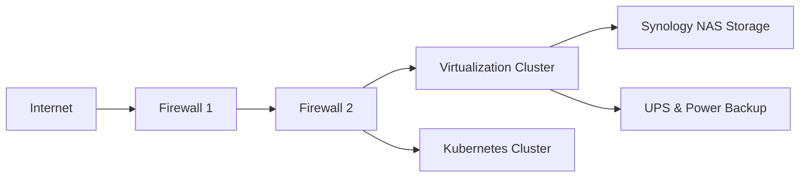

# Stephen Jacobs

## 💻 Senior Software Engineer

I am a **Senior Software Engineer** at [Centerfield](https://www.centerfield.com), specializing in **.NET 9, AWS,** and **event-driven architectures** to develop scalable, high-performance backend systems. With a strong focus on optimizing software development workflows, I continually explore new technologies and methodologies to improve efficiency, maintainability, and system resilience. Passionate about modern cloud infrastructure, I enjoy tackling complex engineering challenges that require innovative solutions.

---

## 🚀 About Me

- **Team Contributor:** Dedicated to collaboration and fostering a productive team environment that thrives on shared knowledge and collective problem-solving.  
- **Continuous Learner:** Passionate about exploring new technologies, staying updated on industry trends, and refining my expertise through hands-on projects.  
- **Mentor & Knowledge Sharer:** Actively guide and support colleagues with real-world insights, fostering a culture of growth and professional development.  
- **Best Practices Advocate:** Ensure code quality and maintainability by advocating for industry best practices, test-driven development, and efficient software design.  
- **Personal & Professional Growth:** Strive for impactful development in both work and life, balancing career success with meaningful personal experiences.

---

## 🎯 Certification Roadmap

I am committed to continuous professional growth and achieving technical excellence through structured learning paths and certification programs.

| **Timeline** | **Certification**                           | **Status**         |
|-------------|--------------------------------------------|--------------------|
| **Q1 2025**  | GitHub Foundations                        | ⏳ In Progress      |
| **Q1 2025**  | Terraform Associate                       | ⏳ In Progress      |
| **Q2 2025**  | AWS Developer Associate                   | ⏳ In Progress      |
| **Q2 2025**  | AWS DevOps Associate                      | ❌ Not Started      |
| **Q3 2025**  | AWS Solutions Architect Professional      | ❌ Not Started      |
| **Q3 2025**  | Security+                                 | ❌ Not Started      |
| **Q4 2025**  | Cloud+                                    | ❌ Not Started      |
| **Q1 2026**  | CNKA (Cloud Native Kubernetes Associate) | ❌ Not Started      |
| **Q2 2026**  | GCP Foundational                          | ❌ Not Started      |

I approach certifications not just as credentials but as opportunities to deepen my understanding of key technologies that drive modern software engineering.

---

## 🌱 Hobbies & Interests

Beyond software engineering, I have a deep appreciation for activities that bring balance and inspiration to my life.

- **Outdoor Exploration:** Hiking, camping, and fishing offer a way to disconnect, recharge, and immerse myself in nature’s beauty.  
- **Cacti & Sustainable Gardening:** I cultivate unique cacti species and practice regenerative farming, integrating sustainable agricultural methods that promote biodiversity and soil health.  
- **Homelab & Tech Experimentation:** I continuously refine and automate self-hosted infrastructure, experimenting with new technologies to improve performance and security while maintaining a robust environment for testing and learning.

---

## 🏟️ Homelab Overview

My homelab is designed for **virtualization, container orchestration, automation,** and **continuous learning.** It serves as a platform to experiment with real-world infrastructure configurations and cutting-edge technologies.

### 🔹 Key Components:
- **Virtualization Cluster** (Intel NUCs) – Supporting VM workloads, high-availability experiments, and network simulations.  
- **Kubernetes Cluster** (Raspberry Pi) – Running containerized applications, developing custom Kubernetes controllers, and managing microservices efficiently.  
- **Firewalls & Security** – Implementing layered security with multiple firewalls, network segmentation, and advanced traffic filtering.  
- **Synology NAS Storage** – Managing reliable backups, high-capacity data storage, and redundancy solutions for critical data.  
- **UPS & Power Backup** – Ensuring stability and uptime during outages, preventing data loss, and protecting hardware investments.  
- **Essential Services** – Running key applications such as Pi-hole (ad-blocking), AdGuard Home (DNS filtering), Jellyfin (media streaming), Homebridge (smart home integration), and other automation tools to streamline workflows and optimize the home environment.

This setup provides a hands-on environment to enhance my understanding of **DevOps**, **cloud automation**, **infrastructure-as-code (IaC),** and **highly available distributed systems**.

---

## 🏡 Family Life

I am a **husband** and **dad** to a 7-year-old, and I deeply value work-life balance. I believe in fostering curiosity, creativity, and problem-solving skills in my child, encouraging an environment where learning is fun and hands-on. Whether it’s working on DIY projects, exploring the outdoors, or experimenting with technology, I love sharing my passions with my family and inspiring the next generation to explore and innovate.

---

## 💌 Connect with Me

I enjoy engaging with like-minded professionals, sharing insights, and collaborating on open-source projects. Feel free to reach out!

| **Platform**  | **Link**                                                                 | **Focus**                                  |
|--------------|--------------------------------------------------------------------------|-------------------------------------------|
| **LinkedIn** | [linkedin.com/in/stephen-lloyd-jacobs](https://linkedin.com/in/stephen-lloyd-jacobs) | Technical leadership & cloud architecture |
| **GitHub**   | [github.com/sjacobsio](https://github.com/sjacobsio)                     | Open-source projects & development        |
| **Email**    | [contact@sjacobs.io](mailto:contact@sjacobs.io)                          | Professional inquiries                    |

---

📬 *Thanks for reading! Feel free to connect, share ideas, or collaborate on exciting projects. Always open to meaningful discussions and new challenges!*

